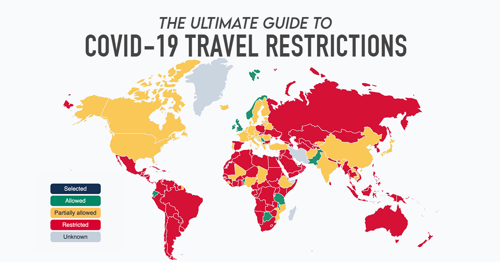

# Project Travel Reopening



[Project Travel Reopening](https://www.tourhero.com/en/ultimate-guide-covid19-travel-restrictions-reopening/) is a free and open source project by [TourHero](https://www.tourhero.com/). It provides an up-to-date view of travel restrictions around the world due to the COVID-19 pandemic. We hope this information will be useful to businesses and individuals who require insights into the global situation in planning their travel.

Our data is pulled from multiple sources including official government websites and news outlets. Selecting a country will display detailed information on domestic travel, international travel, and visa and quarantine regulations current to the destination, as well as relevant links to sources.

### How you can contribute

As the situation changes rapidly around the world, keeping information up-to-date can be challenging. If you spot any incorrect or outdated information, we encourage you to contribute to the project. Alternatively, you can submit data or situation reports from your region to [travel-map@tourhero.com](mailto:travel-map@tourhero.com).

### Disclaimer

Advisories may change without warning. Please check official government websites for up-to-date information on travel restrictions prior to your journeys. This project displays information that is related only to COVID-19 travel restrictions and not to existing restrictions.

## Project setup

```sh
yarn install
```

### Compiles and hot-reloads for development

```sh
yarn serve
```

### Compiles and minifies for production

```sh
yarn build
```

### Run your unit tests

```sh
yarn test:unit
```

### Lints and fixes files

```sh
yarn lint
```
